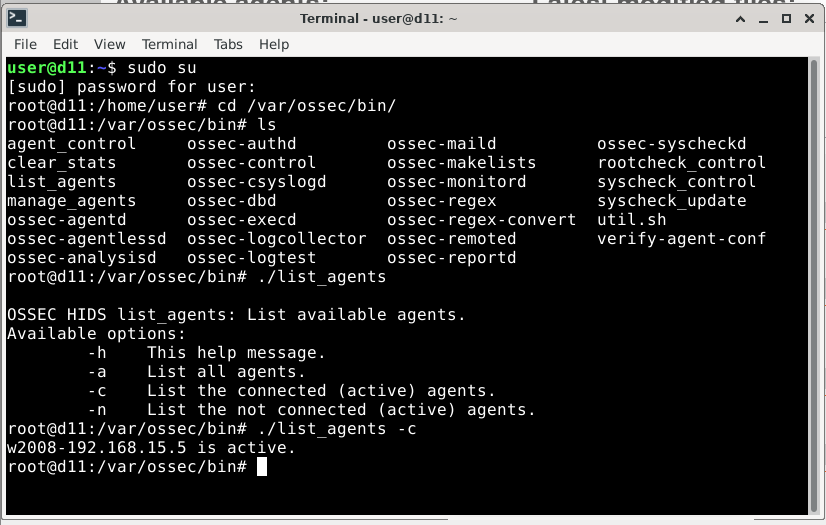
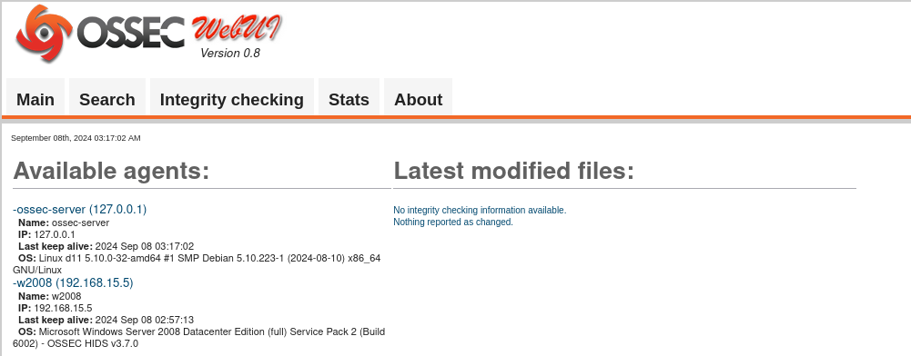
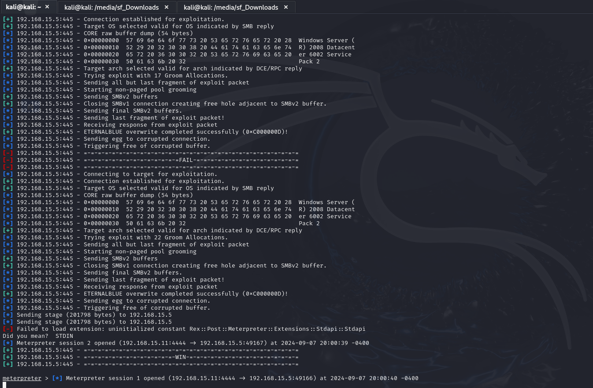
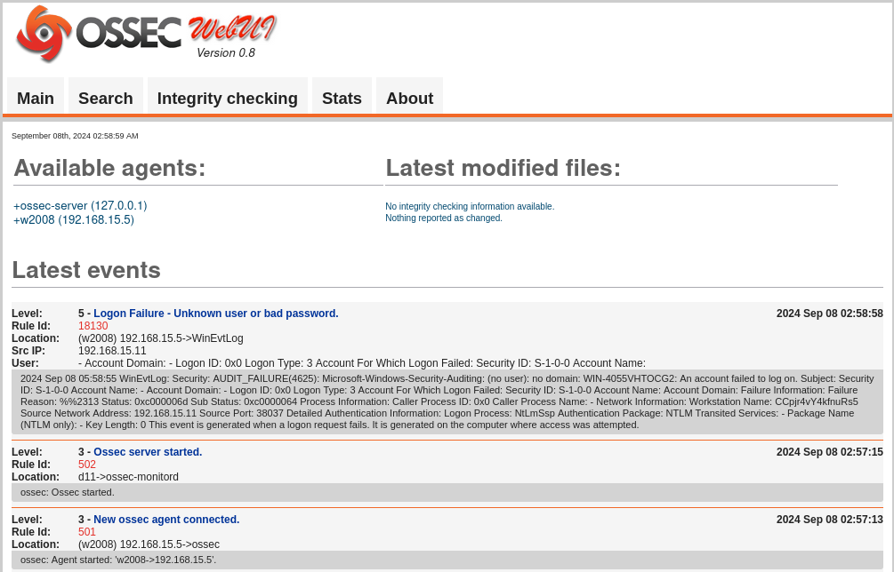

# OSSEC, it's agents and web interface

Homework for sf infosec courses

## Setup

> Setup performed successfully on Debian 11, not sure that legacy WUI will work on newer systems

Running things in this exact order on fresh installed Debian 11 made it work

```bash
#!/bin/sh

# deps, especially for UI
sudo apt update
sudo apt install -y apache2 apache2-utils build-essential fish gcc git inotify-tools libapache2-mod-php libevent-dev libpcre2-dev libpcre3-dev libssl-dev libz-dev make php php-cli php-common sendmail tar unzip vim wget zlib1g-dev

# download and install server
wget -q -O - https://updates.atomicorp.com/installers/atomic | sudo bash
sudo apt update
sudo apt install -y ossec-hids-server

# configure agents
sudo /var/ossec/bin/manage_agents
sudo /var/ossec/bin/ossec-control restart

# UI setup
sudo mv /var/www/html{,_bak}
sudo git clone https://github.com/ossec/ossec-wui.git /var/www/html
cd /var/www/html
sudo ./setup.sh
# ensure specifying 'www-data' when asked for database login
sudo chown -R www-data:www-data /var/www/ # html/ossec-wui/
sudo chmod -R 755 /var/www/               # html/ossec-wui/

# restart apache
sudo a2enmod rewrite
# sudo service apache2 restart
sudo systemctl restart apache2
```

## Screenshots








